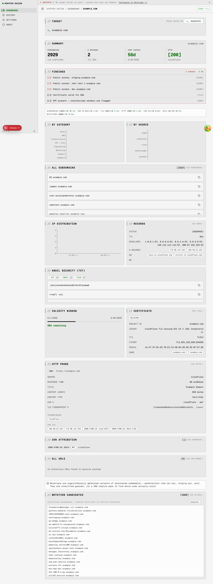
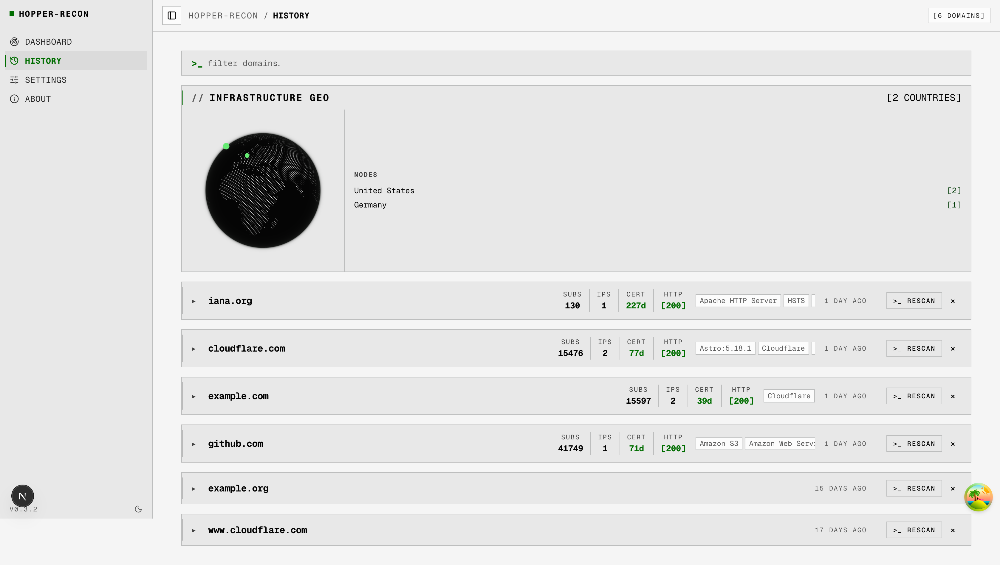
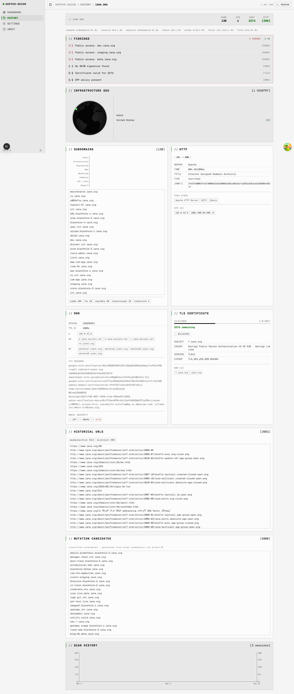
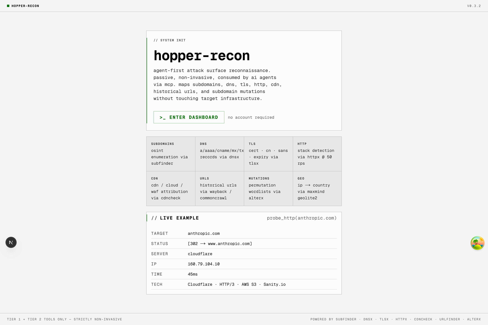

# hopper-recon

Point it at a domain you're authorized to test and get its external attack surface in one dashboard — subdomains, DNS records, TLS certs, HTTP fingerprint, CDN/WAF attribution, historical URLs, and geo distribution. The same recon tools are exposed over **MCP**, so AI agents (Claude Code, Cline, Claude Desktop) can run them directly against the same engine.

Self-hosted — `docker compose up`, SQLite for storage, no external services. Abuse guardrails (gov/mil blocklist, per-target cooldown, scope filter, audit log) are on by default.

[](https://github.com/iksnerd/hopper-recon/actions/workflows/ci.yml)


> ## Authorized use only
>
> Hopper Recon sends DNS, TLS handshake, and HTTP traffic to any target you give it. **Run only against assets you own or have written authorization to test.** Outbound footprint per scan against a single target is roughly **5 DNS queries + 1 TLS handshake + 1 HTTP GET** — equivalent to one browser tab. It is not a stealth tool: HTTP probes identify themselves with a `hopper-recon/<version> (+https://github.com/iksnerd/hopper-recon)` User-Agent so target operators can attribute traffic and request exclusion.
>
> The maintainers do not consent to use of this software against unauthorized third-party infrastructure. See [SECURITY.md](./SECURITY.md) for the full posture and disclosure contact.

---

## Features

- **Dashboard** — runs all OSINT tools in parallel against a target, live elapsed timers, findings triage strip, tech stack detection
- **History** — per-domain timeline with multi-scan charts, geo-globe from IP data, full-page detail view with scrollable subdomain list, cert SAN expansion, redirect chains
- **MCP-native engine** — exposes the same tools at `/mcp` so AI agents drive recon directly; the dashboard is just one consumer
- **Findings strip** — auto-triages expired certs, missing SPF/DMARC, HTTPS→HTTP downgrades, sensitive subdomains
- **Geo globe** — IP → country via bundled MaxMind GeoLite2 (offline), rendered with [cobe](https://cobe.vercel.app)
- **Self-hosted** — `docker compose up` to a working install. SQLite for storage, no external services required
- **Continuous backup via Litestream** — WAL streaming to a local file volume by default; flip a config block to replicate to S3 / R2 / Azure Blob / GCS instead
- **No Docker socket on the web** — the web container talks to the engine over HTTP, so it runs on platforms that forbid privileged containers (Cloud Run, Fly Machines, k8s rootless, etc.)

---

## Screenshots

### Dashboard — `/dashboard`

Runs all 7 OSINT tools in parallel against a target with live elapsed timers. Each tab populates as results arrive — subdomains, DNS records, TLS cert, HTTP stack, CDN attribution, historical URLs, and subdomain mutations. The advisory banner shows when neither `HOPPER_ALLOWED_DOMAINS` nor authentication is configured.



### History — `/history`

Every scanned domain with cert / HTTP / tech metadata, geo distribution, scan recency. Inline `>_ RESCAN` and delete actions. Click into a row for the detail view.



### Domain detail — `/history/<domain>`

The full picture for one domain: findings strip (auto-triaged security signals — expired certs, missing SPF/DMARC, sensitive subdomains), geo globe, subdomain breakdown with category histogram, full HTTP / DNS / TLS panels with redirect chain and SAN expansion, scan-history timeline at the bottom.



### Landing — `/`

What the tool does, with a static `probe_http(anthropic.com)` example baked in. No live recon runs on page load.



---

## Quick start

**Prerequisites:** Docker + Docker Compose. (For development without containers: Node.js 22+, Go 1.26+.)

```bash
git clone https://github.com/iksnerd/hopper-recon
cd hopper-recon

# Optional: drop in a GeoLite2 mmdb so the geo-globe renders
mkdir -p ~/.config/hopper-recon
curl -L https://github.com/P3TERX/GeoLite.mmdb/raw/download/GeoLite2-Country.mmdb \
     -o ~/.config/hopper-recon/GeoLite2-Country.mmdb

# Bring up the stack (engine + web + Litestream sidecars)
docker compose up -d --build

# Open the dashboard
open http://localhost:9120        # macOS
# xdg-open http://localhost:9120  # Linux
```

The engine also listens at `http://127.0.0.1:9119` (loopback only) for direct MCP and REST access — off the well-known `:8080` to avoid colliding with the dozen other dev tools that grab it. Inside the compose network the web reaches the engine via DNS at `engine:8080`.

GeoLite2 is optional (without it the globe just doesn't render). Full setup including the official-MaxMind path, plus subfinder API keys for wider source coverage, is in [DEPLOY.md](./DEPLOY.md#optional-data-sources-geolite2-subfinder-keys).

### Adding to your MCP client

For Claude Code (project `.mcp.json`):

```json
{
  "mcpServers": {
    "hopper-recon": {
      "type": "http",
      "url": "http://127.0.0.1:9119/mcp"
    }
  }
}
```

For one-shot stdio agents (Claude Desktop):

```json
{
  "mcpServers": {
    "hopper-recon": {
      "command": "docker",
      "args": ["run", "--rm", "-i", "hopper-recon:latest", "mcp"]
    }
  }
}
```

The HTTP variant connects to your long-running engine and shares the dashboard's database — anything an agent scans shows up in History. The stdio variant spawns a fresh ephemeral container with no persistence.

---

## Tools

| MCP name | Binary | What it does |
|---|---|---|
| `passive_subdomains` | subfinder | OSINT subdomain enumeration across 40+ sources (free without keys, more with) |
| `resolve_dns` | dnsx | A / **AAAA** / CNAME / NS / MX / TXT records, CDN detection, DMARC merge from `_dmarc.<host>` |
| `fetch_tls_cert` | tlsx | TLS cert details — CN, SANs, expiry, cipher, wildcard/expired/self-signed flags |
| `probe_http` | httpx | HTTP probe — title, tech stack, JARM, CPE, redirect chain. Custom UA, 50 rps cap |
| `check_cdn` | cdncheck | Per-IP CDN / cloud / WAF attribution from bundled CIDR lists (Cloudflare, Akamai, Fastly, AWS, GCP, Imperva, …). Pure offline. |
| `find_urls` | urlfinder | Historical URLs from passive sources (waybackarchive, commoncrawl, alienvault). No requests to the target. |
| `expand_subdomains` | alterx | Permutation-based subdomain wordlist generation from existing subdomains. Pure local transform — no network requests. |
| `resolve_mutations` | alterx + dnsx | Generates permutation candidates (subfinder → alterx) then resolves them via DNS, returning only those with a live A record. Run from the dashboard after `expand_subdomains`. |
| `lookup_geoip` | geoip2-golang | IPs → ISO country codes from a local MaxMind GeoLite2 mmdb. Anycast IPs (Cloudflare / AWS / Google) have no country attribution by design — the dashboard shows an inline note instead of an empty globe. |

**Tools we don't ship**: `asnmap` (requires PDCP API key), `search_hosts` / uncover (requires Shodan/Censys/FOFA keys). Hopper's policy is that every shipped tool must produce useful output for a first-time user without auth setup.

---

## Built-in protections

These ship enabled by default. They live at the **engine** layer (not the web), so direct MCP callers — Claude Code, Cline, one-shot stdio agents — hit the same gates as the dashboard. Full posture in [SECURITY.md](./SECURITY.md); env knobs in [`.env.example`](./.env.example).

| Protection | What it does | Override |
|---|---|---|
| **Restricted-suffix blocklist** | Refuses active probes (`probe_http`, `fetch_tls_cert`) against `.gov`, `.mil`, `.gouv.fr`, `.gov.uk`, `.go.jp`, `.gc.ca`, `.gov.au`. Returns HTTP 451. | `HOPPER_OVERRIDE_BLOCKLIST=true` + non-empty `HOPPER_BLOCKLIST_OVERRIDE_REASON` (audit-logged) |
| **Per-target cooldown** | 60s window per `(target, tool)` pair. Repeats return HTTP 429 with `Retry-After`. Stops mash-the-button accidents. | None — wait it out |
| **Audit log** | Every `/scan` writes one row to `audit_log` with timestamp, source IP, User-Agent, tool, target, decision (allowed / blocked), and reason. | Read with `sqlite3 /data/scans.db 'SELECT * FROM audit_log'` |
| **Scope filter** | When `HOPPER_ALLOWED_DOMAINS` is set, all tools refuse targets outside the listed apexes. Returns HTTP 403. | Unset or extend the list |
| **Custom User-Agent** | `httpx` probes carry `hopper-recon/<version> (+repo URL)` so target operators can attribute and request exclusion. | None — set on every request by design |
| **Operator advisory banner** | First-boot UI banner when neither scope nor auth is configured. Dismissable per-browser. | Configure scope or live with the nag |
| **Loopback engine bind** | Compose binds engine to `127.0.0.1:9119` only. LAN/WAN exposure requires deliberate config change. | Edit `docker-compose.yml` ports + put auth in front first |

`/api/scan` and the engine respond with `X-Hopper-Recon: authorized-use-only` so any reverse-proxy or CDN log identifies the tool. The `/config` endpoint reports scope/auth state as booleans (no env values leaked) — used by the dashboard banner and useful for monitoring.

---

## Architecture

A **Go engine** wraps the [projectdiscovery](https://github.com/projectdiscovery) OSINT tooling and owns its own SQLite at `/data/scans.db`. The **Next.js 16 dashboard** is a thin HTTP client on top — it never spawns Docker per scan and never mounts the Docker socket. The dashboard's `/api/scan` validates input then forwards to the engine's `POST /scan`, which atomically runs the tool, writes the row, and returns the result. Reads go through the engine's REST endpoints. There's a parallel `D1Adapter` for Cloudflare Workers deploys, where the web owns the database directly.

```
hopper-recon/
├── engine/                    # Go server — HTTP REST + stdio MCP, owns SQLite
│   ├── main.go                # Entrypoint, mode dispatch, MCP tool registration
│   ├── tools.go               # Recon-binary runners (subfinder/dnsx/tlsx/httpx/cdncheck/urlfinder/alterx/geoip)
│   ├── policy.go              # Scope filter, gov/mil blocklist, per-target cooldown
│   ├── db.go                  # SQLite schema + queries (WAL mode, load-bearing for Litestream)
│   ├── server.go              # REST handlers + /mcp mount
│   ├── *_test.go              # Unit tests — policy, db, tools, server (no external deps)
│   └── Dockerfile
├── web/                       # Next.js 16 thin client
│   ├── src/app/               # App Router pages + API routes (proxies to engine)
│   ├── src/lib/               # engine-client.ts · db.ts (EngineDB + D1 adapters) · scan-parser.ts
│   ├── src/components/recon/  # Shared UI primitives — Panel, ReconCard, PageHeader, GeoGlobe
│   ├── schema.sql             # Cloudflare D1 mirror of engine/db.go schema
│   └── Dockerfile
├── docker-compose.yml         # Engine + web + Litestream sidecars + named volumes
├── litestream.yml             # Replica config — local file (default) or S3 / R2 / Azure / GCS
└── .env.example               # All env vars documented with defaults + secret column
```

---

## Configuration

Full reference + commented Litestream cloud-replica blocks live in [`.env.example`](./.env.example). Copy it to `.env` next to `docker-compose.yml`; both engine and Litestream sidecars pick it up automatically.

| Env / file | Default | Purpose |
|---|---|---|
| `ENGINE_URL` | `http://127.0.0.1:9119` (dev) / `http://engine:8080` (compose) | Where the web finds the engine |
| `HOPPER_DB_PATH` | `/data/scans.db` | SQLite path inside the engine container |
| `HOPPER_ADDR` | `:8080` | Engine HTTP listen address |
| `HOPPER_ALLOWED_DOMAINS` | _(unset)_ | Comma-separated apex list; off-scope targets return 403. Unset = scan anything (dashboard then nags) |
| `HOPPER_OVERRIDE_BLOCKLIST` | _(unset)_ | Set to `true` (with `HOPPER_BLOCKLIST_OVERRIDE_REASON`) to allow `.gov` / `.mil` / equivalent probes. Audit-logged. |
| `HOPPER_BLOCKLIST_OVERRIDE_REASON` | _(unset)_ | Free-text reason recorded in `audit_log` when an override fires. Both vars must be non-empty. |
| `~/.config/subfinder/` | — | Subfinder config + optional API keys (rw mount) |
| `~/.config/hopper-recon/GeoLite2-Country.mmdb` | — | MaxMind GeoLite2 (ro mount, optional) |

Optional data sources (GeoLite2 setup, subfinder keys) and continuous backups (Litestream — local file by default, cloud DR via S3 / R2 / Azure / GCS) are covered in [DEPLOY.md](./DEPLOY.md).

---

## Docs

- **[DEPLOY.md](./DEPLOY.md)** — production deployment: env vars, ports, volumes, single-VM topology, Litestream backups & restore, Kubernetes, hardening checklist
- **[CONTRIBUTING.md](./CONTRIBUTING.md)** — dev setup, pre-commit checks, PR conventions, adding a recon tool
- **[SECURITY.md](./SECURITY.md)** — authorized-use posture, threat model, disclosure contact
- **[CLAUDE.md](./CLAUDE.md)** — architecture deep-dive and agent/developer guide
- **[CHANGELOG.md](./CHANGELOG.md)** — release history
- **[TODO.md](./TODO.md)** — roadmap and outstanding work

---

## Roadmap

See [TODO.md](./TODO.md).

- **v0.1.0** ✓ — MIT license, CI, SECURITY.md, abuse mitigations (gov/mil blocklist, cooldown, audit log, scope filter, advisory banner)
- **v0.2.0** ✓ — engine owns SQLite + all recon tools, web is a thin HTTP client, MCP at `/mcp` for AI agents
- **v0.3.0** ✓ — alterx (`expand_subdomains` / `resolve_mutations`) mutation tools, OSS polish, Litestream backups
- **Next** — self-hosted auth (Auth.js — OIDC + email magic-link), `/admin` route, audit-log viewer

---

## License

MIT — see [LICENSE](./LICENSE).
